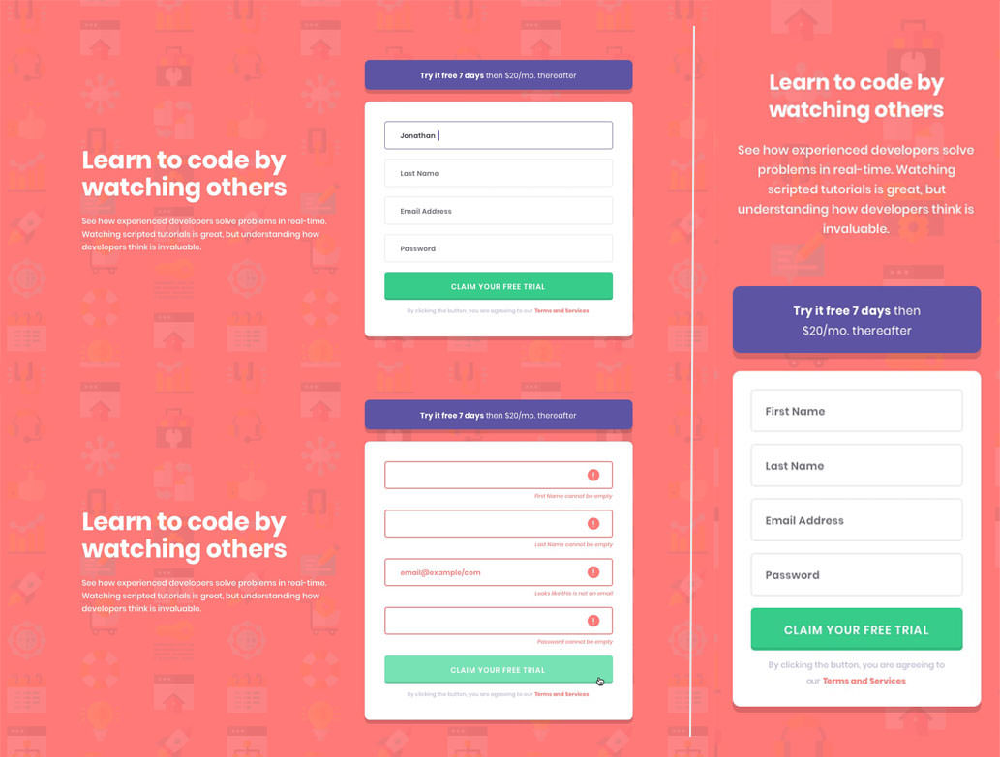

# [Frontend Mentor - Intro component with sign-up form Challenge](https://www.frontendmentor.io/challenges/intro-component-with-signup-form-5cf91bd49edda32581d28fd1)

- ## [Deployed on Vercel](https://fm-intro-component-with-signup-form-theta.vercel.app/)
- ## [GitHub Repository](https://github.com/panosjapan7/fm-intro-component-with-signup-form)
- ## [My Frontend Mentor Profile](https://www.frontendmentor.io/profile/panosjapan7)
** **
- ### Built with
    - Semantic HTML5 markup
    - CSS
    - Flexbox
    - JavaScript

